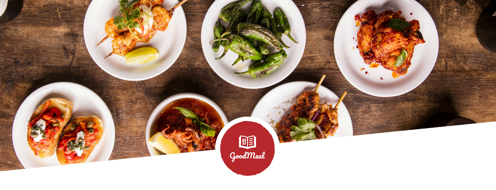
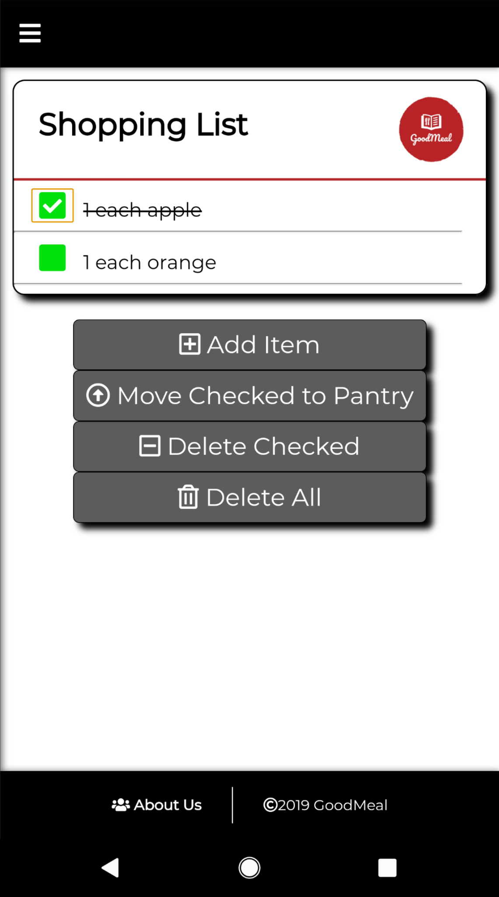

# Good Meal Client

Good Meal is your digital recipe card index file, where users can create and share private and public recipes, store shopping lists, lists of items already in their pantry and create shopping lists from the recipes they have.

Live app: https://good-meal-client.herokuapp.com/

client repo: https://github.com/thinkful-ei-firefly/recipe-client

server repo: https://github.com/thinkful-ei-firefly/recipe-server

## Demo account
username: demo
password: Password1

## Installation
* clone from github
* run "npm install"
* run "npm start"

## Routes

### Home Screen - signed out

### Home Screen - signed in

### Login

### Register

### List All Recipes Public/Private

### Single Recipe

### Add New Recipe

### Shopping List

### Pantry List

## Additional Features

### Move Shopping List Items to Pantry

### Mobile Nav Menu

## User Stories:

* User can create an account. 
* User can login to an account.
* User can logout.
* User can add a recipe.
* User can view an overview of their recipes.
* User can click on a recipe to see all information on it.
* User can add a picture to a recipe
* User can search for recipes.
* User can fliter recipes by ingredients they own.
* User can set a recipe to be "public"
* User can see other users public recipes
* User can create a shopping list of items
* User can add custom items to their shopping list
* User can remove items from their shopping list
* User can "cross off" items from their shopping list
* User can keep track of ingredients they have in their pantry
* User can generate a shopping list from what they want to cook
* User can edit their recipe
* User can see a list of Public recipes
* User can login with Google
* User can login with Facebook
* User can rate recipes
* User can share a recipe via Facebook
* User can share a recipe via Twitter
* User can share a recipe via email

## Technologies Used

* HTML5
* CSS3
* JavaScript

* React.js
* Node.js
* Express
* PostgreSQL

* Heroku
* Firebase
* AWS
* Jason Web Tokens
* FontAwesome
* Site Maps
* Schema.org
